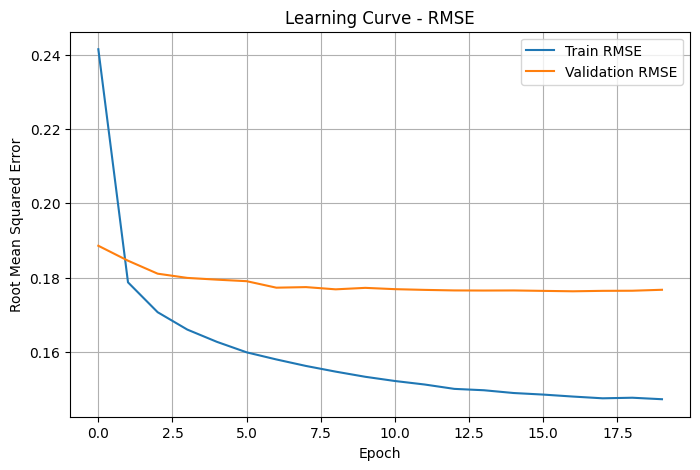

# Laporan Proyek Machine Learning - Cindy Alya Putri

## Project Overview
##**Latar Belakang**

Dalam era digital saat ini, semakin banyak pengguna yang mengakses buku secara online, baik untuk keperluan belajar maupun hiburan. Namun, jumlah buku yang sangat besar justru sering membuat pengguna kesulitan dalam memilih bacaan yang sesuai dengan minat mereka. Hal ini menimbulkan kebutuhan akan sistem yang mampu memberikan rekomendasi secara otomatis dan personal.

Sistem rekomendasi buku dapat menjadi solusi untuk membantu pengguna menemukan bacaan yang relevan dengan preferensi mereka. Dua pendekatan yang sering digunakan adalah Content-based Filtering dan Collaborative Filtering. Content-based Filtering bekerja dengan menganalisis karakteristik buku yang disukai pengguna, sedangkan Collaborative Filtering memanfaatkan pola interaksi antar pengguna untuk memberi rekomendasi berdasarkan kesamaan perilaku.

Kedua pendekatan ini terbukti efektif dan banyak dikembangkan dalam penelitian. Parthasarathya dan Devi \[1] menunjukkan bahwa kombinasi keduanya dalam sistem hybrid dapat meningkatkan akurasi dan relevansi rekomendasi. Zhou et al. \[2] juga mengembangkan metode Collaborative Filtering berbasis kemiripan yang ditingkatkan, sehingga hasil rekomendasinya lebih akurat. Selain itu, Mukti dan Baizal \[3] mengimplementasikan model Neural Collaborative Filtering yang dipadukan dengan metadata buku dan berhasil meningkatkan performa sistem dalam konteks rekomendasi buku di Indonesia.

Melalui proyek ini, sistem rekomendasi buku dikembangkan menggunakan pendekatan Content-based dan Collaborative Filtering pada dataset Book-Crossing. Tujuannya adalah membantu pengguna menemukan buku yang sesuai dengan preferensi mereka secara lebih cepat, efisien, dan personal.


**Referensi**

\[1] G. Parthasarathya and S. S. Devi, “Hybrid Recommendation System Based on Collaborative and Content-Based Filtering,” *Cybernetics and Systems*, vol. 54, no. 4, pp. 432–453, May 2022.

\[2] W. Zhou, R. Li, and W. Liu, “Collaborative Filtering Recommendation Algorithm based on Improved Similarity,” *Proc. 2020 IEEE 5th Information Technology and Mechatronics Eng. Conf. (ITOEC)*, pp. 321–324, 2020.

\[3] P. A. S. Mukti and Z. K. A. Baizal, “Enhancing Neural Collaborative Filtering with Metadata for Book Recommender System,” *Indonesian Journal of Computing and Cybernetics Systems*, vol. 19, no. 1, 2025.

## Business Understanding

Bagian ini menjelaskan landasan permasalahan yang menjadi fokus dalam pengembangan sistem rekomendasi buku berbasis machine learning. Sistem ini ditujukan untuk membantu pengguna dalam menemukan bacaan yang sesuai dengan preferensi mereka, terutama ketika berhadapan dengan ribuan pilihan buku yang tersedia secara digital.

### **Problem Statements**

1. Jumlah buku yang sangat banyak di platform digital sering membuat pengguna kewalahan dalam memilih, terutama jika mereka tidak tahu harus mulai dari mana.
2. Banyak pengguna baru atau yang jarang berinteraksi tidak memberikan cukup rating, sehingga sulit diketahui preferensinya tanpa sistem yang cerdas.
3. Pengalaman pengguna yang personal sangat dibutuhkan untuk meningkatkan kenyamanan, membuat pengguna lebih betah, dan kembali menggunakan platform secara rutin.

### **Goals**

1. Menyediakan rekomendasi buku yang relevan dengan minat pengguna berdasarkan interaksi sebelumnya, seperti buku yang pernah mereka beri rating.
2. Membantu pengguna menghindari kebingungan dalam memilih dengan memberikan daftar rekomendasi yang telah disesuaikan.
3. Meningkatkan durasi dan frekuensi keterlibatan pengguna dengan sistem melalui rekomendasi yang menarik dan relevan.
4. Mendorong pengguna untuk mencoba buku dari genre atau penulis yang masih berhubungan dengan minat mereka, sehingga memperluas pengalaman membaca mereka.

### **Solution Statements**

Beberapa pendekatan machine learning akan digunakan dalam proyek ini, antara lain:

#### **Content-Based Filtering (CBF)**

Mengandalkan informasi dari buku itu sendiri misalnya judul dan penulis untuk mengukur kemiripan antar buku. Teknik seperti TF-IDF dan cosine similarity akan digunakan untuk merekomendasikan buku yang mirip dengan yang disukai pengguna sebelumnya.

* **Kelebihan**: Tetap bisa memberikan rekomendasi meski pengguna baru belum banyak berinteraksi.
* **Kekurangan**: Hanya memberikan saran yang serupa, sehingga potensi eksplorasi terbatas.

#### **User-Based Collaborative Filtering**

Menggunakan pola perilaku dan kesamaan preferensi antar pengguna. Jika dua pengguna memiliki selera yang mirip, maka buku yang disukai oleh salah satunya bisa direkomendasikan ke yang lain.

* **Kelebihan**: Bisa menangkap pola preferensi antar pengguna dengan cukup baik.
* **Kekurangan**: Sulit bekerja jika pengguna baru atau data rating masih sedikit (*cold start* problem).

#### **Model-Based Collaborative Filtering (TensorFlow/Keras)**

Menggunakan pendekatan deep learning untuk membuat model rekomendasi berbasis embedding, sehingga sistem mampu memahami hubungan laten antara pengguna dan buku.

* **Kelebihan**: Mampu menangkap pola kompleks dan menghasilkan prediksi yang lebih presisi.
* **Kekurangan**: Membutuhkan waktu pelatihan lebih lama dan data yang lebih banyak.


## Data Understanding

### 1. Unduhan dan Ekstraksi Dataset

Dataset yang digunakan dalam proyek ini adalah *Book Recommendation Dataset* dari Kaggle. Dataset diunduh dan diekstrak ke dalam folder book_data/ untuk kemudian dianalisis. Dataset ini terdiri dari tiga file utama: Books.csv, Users.csv, dan Ratings.csv.

### 2. Gambaran Umum Dataset

Setelah file diekstrak dan dimuat ke dalam DataFrame, didapatkan jumlah data sebagai berikut:

* Books.csv: 271.360 baris, 8 kolom
* Users.csv: 278.858 baris, 3 kolom
* Ratings.csv: 1.149.780 baris, 3 kolom

### 3. Eksplorasi Data Books.csv
```
<class 'pandas.core.frame.DataFrame'>
RangeIndex: 271360 entries, 0 to 271359
Data columns (total 8 columns):
 #   Column               Non-Null Count   Dtype 
---  ------               --------------   ----- 
 0   ISBN                 271360 non-null  object
 1   Book-Title           271360 non-null  object
 2   Book-Author          271358 non-null  object
 3   Year-Of-Publication  271360 non-null  object
 4   Publisher            271358 non-null  object
 5   Image-URL-S          271360 non-null  object
 6   Image-URL-M          271360 non-null  object
 7   Image-URL-L          271357 non-null  object
dtypes: object(8)
memory usage: 16.6+ MB
```

* Dataset berisi informasi seperti ISBN, judul buku, penulis, tahun terbit, penerbit, dan URL gambar.
* Tipe data seluruh kolom adalah object (string).
* Ditemukan *missing value* pada tiga kolom:

  * Book-Author: 2 nilai kosong
  * Publisher: 2 nilai kosong
  * Image-URL-L: 3 nilai kosong
* Tidak ditemukan baris duplikat dalam data buku.
* Ditemukan banyak ISBN yang unik, menandakan variasi buku yang tinggi. Beberapa judul atau gambar buku ditemukan berulang, yang menjadi indikasi adanya kemungkinan duplikasi berdasarkan konten, bukan baris.

### 4. Eksplorasi Data Ratings.csv
```
<class 'pandas.core.frame.DataFrame'>
RangeIndex: 1149780 entries, 0 to 1149779
Data columns (total 3 columns):
 #   Column       Non-Null Count    Dtype 
---  ------       --------------    ----- 
 0   User-ID      1149780 non-null  int64 
 1   ISBN         1149780 non-null  object
 2   Book-Rating  1149780 non-null  int64 
dtypes: int64(2), object(1)
memory usage: 26.3+ MB
```

* Data terdiri dari 3 kolom utama: User-ID, ISBN, dan Book-Rating.
* Tidak ditemukan *missing value* dan semua entri valid secara struktur.
* Nilai rating berkisar dari 0 hingga 10, dengan rata-rata sekitar 2.87.
* Sekitar 50% entri memiliki rating 0, yang kemungkinan merepresentasikan *implicit feedback*.
* Ditemukan lebih dari 340 ribu ISBN unik, menunjukkan banyak variasi buku yang telah dinilai.
* Tidak ditemukan baris duplikat dalam data rating.

### 5. Eksplorasi Data Users.csv
```
<class 'pandas.core.frame.DataFrame'>
RangeIndex: 278858 entries, 0 to 278857
Data columns (total 3 columns):
 #   Column    Non-Null Count   Dtype  
---  ------    --------------   -----  
 0   User-ID   278858 non-null  int64  
 1   Location  278858 non-null  object 
 2   Age       168096 non-null  float64
dtypes: float64(1), int64(1), object(1)
memory usage: 6.4+ MB
```
* Terdiri dari 3 kolom utama: User-ID, Location, dan Age.
* Terdapat 110.762 entri usia yang hilang (sekitar 40% data).
* Ditemukan nilai usia tidak wajar, misalnya 0 tahun hingga 244 tahun, yang menandakan adanya data ekstrem atau anomali.
* Lokasi pengguna sangat bervariasi dengan lebih dari 57.000 lokasi unik, dan lokasi terbanyak berasal dari London, Inggris.
* Tidak ditemukan duplikasi pada data pengguna.

---

## Kesimpulan Awal

Berdasarkan hasil eksplorasi ini, dapat disimpulkan bahwa:

* Dataset secara umum cukup bersih dan terstruktur, namun terdapat beberapa *missing value* dan outlier, terutama pada data pengguna (Age).
* Variasi data cukup tinggi, baik dari sisi buku maupun pengguna.
* Beberapa data rating tampak sebagai *implicit feedback* (nilai 0) yang harus ditangani dengan tepat saat modeling.
* Tidak ada data duplikat yang perlu dihapus pada tahap awal ini.

Langkah selanjutnya adalah melakukan *data cleaning* lanjutan, termasuk imputasi atau pembuangan data tidak valid, normalisasi nilai, dan persiapan untuk proses modeling sistem rekomendasi.

**Rubrik/Kriteria Tambahan (Opsional)**:
## Exploratory Data Analysis (EDA)
#### 1. 10 Buku dengan Rating Terbanyak

Analisis ini mengambil 10 ISBN dengan jumlah rating terbanyak dari dataset ratings, kemudian menggabungkannya dengan data books untuk mendapatkan judul dan penulis.

Buku berjudul **"Wild Animus"** tercatat sebagai buku dengan rating terbanyak, melebihi 2.500 rating. Jaraknya cukup jauh dibanding buku lain seperti *The Lovely Bones* dan *The Da Vinci Code*. Ini mengindikasikan bahwa buku tersebut kemungkinan besar mengalami promosi masif atau bahkan distribusi gratis dalam skala besar.

Beberapa buku yang muncul dalam daftar merupakan buku bestseller yang cukup dikenal luas. Ini menunjukkan bahwa buku populer cenderung mendapat lebih banyak interaksi dari pengguna.

Terdapat satu ISBN yang tidak memiliki informasi judul dan ditampilkan sebagai "Unknown Title", yang menandakan bahwa metadata dalam file books.csv tidak lengkap. Kondisi ini penting diperhatikan dalam pengembangan sistem rekomendasi, karena informasi seperti judul dan penulis sangat membantu dalam memberikan rekomendasi yang bermakna bagi pengguna.

Data ini juga sangat cocok digunakan untuk metode **rekomendasi berbasis popularitas**, terutama untuk pengguna baru yang belum memiliki histori interaksi.

---

#### 2. Distribusi Nilai Rating Buku

Visualisasi distribusi rating menunjukkan bahwa sebagian besar rating yang diberikan oleh pengguna adalah **rating 0**. Namun, rating valid dengan nilai tinggi seperti **8**, **9**, dan **10** juga cukup sering muncul. Ini menunjukkan adanya kecenderungan pengguna memberikan rating hanya pada buku yang mereka sukai.

Ketimpangan antara rating 0 dan rating valid cukup besar. Rating 0 bisa dianggap sebagai bentuk implicit feedback, yaitu ketika pengguna telah membaca atau melihat buku namun tidak memberikan rating eksplisit.

Distribusi ini perlu diperhatikan dalam pembangunan sistem rekomendasi, karena akan mempengaruhi pendekatan dalam memproses interaksi pengguna.

---

#### 3. Distribusi Usia Pengguna

Hasil visualisasi distribusi usia pengguna menunjukkan bahwa sebagian besar pengguna berada dalam rentang usia **20 hingga 50 tahun**, dengan puncaknya di sekitar usia **30 tahun**. Ini mencerminkan bahwa pengguna aktif berada dalam usia produktif dan dewasa muda.

Namun, terdapat nilai-nilai usia yang tidak wajar, seperti di atas 100 tahun hingga mendekati 244 tahun. Nilai-nilai ini kemungkinan besar merupakan kesalahan input dan perlu ditangani pada tahap data cleaning agar tidak mengganggu analisis dan modeling.

---

### Kesimpulan

Hasil EDA memberikan gambaran awal mengenai karakteristik data dan pola-pola penting yang muncul:

* Buku populer cenderung mendapat banyak rating, dan ini relevan untuk pendekatan rekomendasi berbasis popularitas.
* Terdapat ketimpangan distribusi rating yang menunjukkan kecenderungan pengguna memberi rating hanya pada buku yang mereka sukai.
* Usia pengguna mayoritas berada dalam rentang yang wajar, namun terdapat data anomali yang harus dibersihkan.
* Kelengkapan metadata buku sangat penting dalam sistem rekomendasi.

Tahapan selanjutnya sebaiknya difokuskan pada pembersihan data dan pemilihan strategi modeling yang sesuai dengan karakteristik data yang telah ditemukan.

## Data Preparation
Sebelum memasuki tahap pemodelan, data preparation dilakukan untuk memastikan bahwa data bersih, relevan, dan efisien secara komputasi. Berikut ini adalah 11 langkah utama yang diterapkan dalam proses pembersihan dan persiapan data:

---

### 1. Imputasi Missing Value pada Kolom Age

Kolom Age memiliki 110.762 nilai kosong (missing). Jika baris-baris tersebut dihapus, maka sekitar 40% data akan hilang, yang dapat mengganggu distribusi data pengguna secara keseluruhan. Oleh karena itu, imputasi dilakukan menggunakan nilai median. Median dipilih karena lebih tahan terhadap outlier dibandingkan mean.


**Hasil:**

* Missing sebelum: 110.762
* Setelah imputasi: 0
* Jumlah total data: 278.858 baris

---

### 2. Pembersihan Outlier pada Kolom Age

Terdapat data usia ekstrem seperti 0 dan 244 tahun yang tidak masuk akal secara logis. Untuk meningkatkan kualitas data, hanya usia dalam rentang 5–100 tahun yang dipertahankan.

**Hasil:**

* Sebelum: 278.858 baris
* Setelah: 277.610 baris

---

### 3. Penghapusan Nilai Rating 0

Rating dengan nilai 0 diinterpretasikan sebagai "tidak memberikan penilaian" dan tidak memberikan informasi preferensi pengguna yang berguna. Maka, data dengan rating 0 dihapus.

**Hasil:**

* Sebelum: 1.149.780 baris
* Setelah: 433.671 baris

---

### 4. Menyaring Pengguna yang Pasif

Pengguna yang hanya memberi 1–2 rating tidak memberikan sinyal preferensi yang cukup kuat. Oleh karena itu, hanya pengguna yang memberikan minimal 3 rating yang dipertahankan.

---

### 5. Pemilihan 2500 User Paling Aktif

Dari pengguna aktif yang tersisa, hanya 2500 pengguna dengan jumlah rating terbanyak yang dipertahankan. Hal ini dilakukan untuk membatasi ukuran data agar tidak menyebabkan crash saat komputasi di Google Colab, yang memiliki batas memori terbatas.

---

### 6. Menyaring Buku dengan Rating Minim

Buku yang hanya memiliki sedikit rating tidak cukup representatif untuk dianalisis. Oleh karena itu, hanya buku yang memperoleh minimal 3 rating yang dipertahankan untuk mengurangi noise dalam data.


**Hasil setelah langkah 4–6:**

* Jumlah data rating: 433.671 → sekitar 350.000
* Jumlah user unik: 2.469
* Jumlah buku unik: 15.048

---

### 7. Konversi Kolom menjadi List

Tiga kolom utama (User-ID, ISBN, dan Book-Rating) dikonversi ke dalam bentuk list untuk memudahkan pengolahan pada tahap selanjutnya.

---

### 8. Membuat DataFrame Bersih
```
   user_id       isbn  book_rating
0   276847  3404148576            8
1   276847  3404921178            7
2   276847  3426029553            8
3   276847  3442413508           10
4   276847  3442437717            7
...
98396   276688  0743202694           10
98397   276688  0836218655           10
98398   276688  0836236688           10
98399   276688  0892966548           10
98400   276688  1551669315            6

[98401 rows × 3 columns]
```

Dari list yang telah dibuat, disusun kembali sebuah DataFrame baru bernama ratings_clean yang berisi tiga kolom utama: user\_id, isbn, dan book\_rating. Struktur ini lebih terorganisir untuk keperluan modeling.

---

### 9. Pembuatan User-Item Matrix
```
User-Item Matrix Shape: (2469, 15048)

isbn       0002005018  0002116286  0002251760  0002259001  0002550563  ...  B00009EF82  B0000AA9IZ
user_id                                                                                
242              NaN        NaN        NaN        NaN        NaN     ...        NaN        NaN
254              NaN        NaN        NaN        NaN        NaN     ...        NaN        NaN
507              NaN        NaN        NaN        NaN        NaN     ...        NaN        NaN
638              NaN        NaN        NaN        NaN        NaN     ...        NaN        NaN
643              NaN        NaN        NaN        NaN        NaN     ...        NaN        NaN

[5 rows × 15048 columns]
```
User-Item Matrix dibuat menggunakan fungsi pivot_table dari pandas. Matriks ini penting sebagai dasar pendekatan collaborative filtering karena memetakan interaksi antara pengguna dan buku berdasarkan rating.

**Hasil:**

* Dimensi matriks: 2469 pengguna × 15.048 buku

---

### 10. Encoding ID ke Integer

Sebagian besar algoritma machine learning tidak menerima input berupa string. Oleh karena itu, dilakukan proses encoding untuk mengubah user\_id dan isbn menjadi angka. Selain itu, dibuat pula mapping kebalikannya untuk kebutuhan interpretasi hasil prediksi.
---

### 11. Normalisasi Rating dan Split Data

Nilai rating dinormalisasi ke rentang 0–1 untuk meningkatkan stabilitas proses pelatihan model. Selanjutnya, data dibagi menjadi training dan validation set dengan rasio 80:20. Pembagian ini penting untuk memastikan bahwa model tidak hanya menghafal data tetapi juga mampu melakukan generalisasi.

**Hasil:**

* x\_train: (346.936, 2), y\_train: (346.936,)
* x\_val: (86.735, 2), y\_val: (86.735,)

---

## **Kesimpulan**

Seluruh tahap data preparation di atas dilakukan untuk memastikan data memiliki kualitas yang baik, efisien, dan siap digunakan dalam pembuatan model sistem rekomendasi berbasis collaborative filtering. Setiap keputusan pembersihan, penyaringan, dan transformasi dilakukan dengan pertimbangan praktis maupun teoritis yang jelas, termasuk keterbatasan teknis platform pemrosesan (Google Colab). Data hasil akhir telah dikondisikan ke dalam bentuk dan skala yang sesuai untuk kebutuhan pelatihan model berbasis embedding dan similarity calculation.


## Modeling
### 1. Content-Based Filtering

#### TF-IDF Vectorization
**Matriks TF-IDF**: (14.437, 10.949)
- **14.437 baris**: Judul buku unik yang diproses
- **10.949 kolom**: Kata unik (fitur) setelah pembersihan, tokenisasi, dan penghapusan stop words

#### Cosine Similarity
**Matriks Cosine Similarity**: (14.437, 14.437)
- Mengukur kemiripan antar judul buku
- Nilai 0 = tidak mirip, 1 = mirip sempurna
- Basis untuk rekomendasi berdasarkan kemiripan konten judul

#### Fungsi Rekomendasi
**Teknik**: Menggunakan Cosine Similarity Matrix, mencari index buku berdasarkan judul, mengurutkan skor kemiripan dan memilih Top-N buku tertinggi.

**Contoh Implementasi**: `recommend_books('Wild Animus')`

#### Hasil Rekomendasi Content-Based Filtering

**Input**: Wild Animus

| No | Book-Title       | Book-Author     |
|----|------------------|-----------------|
| 1  | Into the Wild    | Jon Krakauer    |
| 2  | Call of the Wild | Jack London     |
| 3  | Wild About You   | Robin Wells     |
| 4  | Wild             | Lori Foster     |
| 5  | A Heart So Wild  | Johanna Lindsey |

**Interpretasi**: Semua rekomendasi mengandung kata "Wild", menunjukkan sistem berhasil mendeteksi kemiripan tekstual antar judul.

---

### 2. User-Based Collaborative Filtering

#### User Similarity Matrix
**Dimensi**: (2.469, 2.469)
- **2.469 pengguna** aktif dengan minimal satu rating
- Menggunakan cosine similarity pada pola rating
- Nilai NaN diisi dengan 0 sebelum perhitungan

#### Proses Rekomendasi
1. Menghitung skor kemiripan pengguna target dengan semua pengguna lain
2. Memilih 5 pengguna paling mirip
3. Menghitung rata-rata rating buku dari 5 pengguna tersebut
4. Menyaring buku yang belum dirating pengguna target
5. Mengambil Top-N buku berdasarkan rata-rata rating tertinggi
6. Menggabungkan dengan data deskriptif (ISBN, judul, penulis)

#### Hasil Rekomendasi User-Based Collaborative Filtering

**Input**: User ID 1435

| No | ISBN       | Book-Title                                                          | Book-Author            | Average-Rating |
|----|------------|---------------------------------------------------------------------|------------------------|----------------|
| 1  | 1592400876 | *Eats, Shoots & Leaves: The Zero Tolerance Approach to Punctuation* | Lynne Truss            | 10.0           |
| 2  | 0451191145 | *Atlas Shrugged*                                                    | Ayn Rand               | 10.0           |
| 3  | 0394747232 | *Maus: A Survivor's Tale: My Father Bleeds History*                 | Art Spiegelman         | 10.0           |
| 4  | 067942895X | *The Complete Collected Poems of Maya Angelou*                      | Maya Angelou           | 10.0           |
| 5  | 0836270096 | *Magic Eye, Vol. 2*                                                 | N.E. Thing Enterprises | 10.0           |

**Catatan**: Rating sempurna (10.0) menunjukkan konsistensi preferensi pengguna dengan pola rating serupa.

---

### 3. Collaborative FIltering Menggunakan Keras

#### Arsitektur Model
- **User Embedding Layer**: Representasi vektor laten untuk setiap user
- **Book Embedding Layer**: Representasi vektor laten untuk setiap buku  
- **Bias Layer**: Bias untuk user dan buku
- **Dot Product**: Menghitung kecocokan user-buku
- **Activation**: Sigmoid (output rentang 0-1)

#### Konfigurasi Training
- **Loss Function**: Binary Crossentropy
- **Optimizer**: Adam (learning rate = 0.001)
- **Batch Size**: 8
- **Epochs**: 20 maksimal (keterbatasan Google Colab)
- **Metrik**: Root Mean Squared Error (RMSE)
- **Regularisasi**: EarlyStopping (patience=5, restore_best_weights=True)

#### Hasil Training
- **RMSE Training**: 0.1473
- **RMSE Validation**: 0.1763 (epoch ke-17)
- **Status**: Model stabil dengan generalisasi baik

#### Proses Pengujian
1. **Pemilihan User**: User ID 13552 (acak)
2. **Identifikasi Buku**: Pisahkan buku yang sudah/belum dirating
3. **Konversi Data**: ISBN ke format numerik menggunakan encoding map
4. **Prediksi Rating**: Model memprediksi skor preferensi
5. **Seleksi Top-5**: Buku dengan prediksi skor tertinggi
6. **Penyajian**: Konversi kembali ke format ISBN asli dengan data deskriptif

#### Hasil Rekomendasi Deep Learning

**Input**: User ID 13552

| No | ISBN       | Judul Buku                                                  | Penulis             |
|----|------------|-------------------------------------------------------------|---------------------|
| 1  | 0394800389 | *Fox in Socks (I Can Read It All by Myself Beginner Books)* | Dr. Seuss           |
| 2  | 0618002235 | *The Two Towers (The Lord of the Rings, Part 2)*            | J. R. R. Tolkien    |
| 3  | 089471838X | *Natural California: A Postcard Book*                       | Not Applicable (Na) |
| 4  | 0836213319 | *Dilbert: A Book of Postcards*                              | Scott Adams         |
| 5  | 0439425220 | *Harry Potter and the Chamber of Secrets Postcard Book*     | J. K. Rowling       |

#### Interpretasi Hasil Deep Learning

1. **Kesesuaian dengan Minat**: Model mendeteksi preferensi beragam (buku anak, fiksi fantasi, humor)
2. **Relevansi Genre**: Mencerminkan keragaman dari literatur anak-anak hingga fantasi epik
3. **Kualitas Model**: Semua rekomendasi belum pernah dirating user, sesuai prinsip personalized recommendation
4. **Keterbatasan**: Beberapa buku bersifat visual/koleksi yang mungkin kurang relevan secara tematik

---

### Kesimpulan

1. **Content-Based Filtering**: Efektif untuk kemiripan tekstual judul, cocok untuk cold start problem
2. **User-Based Collaborative Filtering**: Memberikan rekomendasi berkualitas tinggi berdasarkan preferensi pengguna serupa
3. **Deep Learning (RecommenderNet)**: Menghasilkan rekomendasi personal yang variatif dengan performa stabil dan generalisasi baik

**Rekomendasi Pengembangan**: Kombinasi ketiga metode dapat menghasilkan sistem rekomendasi yang lebih komprehensif, dengan penambahan fitur genre, sinopsis, atau metadata lain untuk meningkatkan konteks rekomendasi.

## Evaluation
### **Evaluation Report**

Pada bagian ini, saya mengevaluasi kinerja sistem rekomendasi yang telah dibangun menggunakan dua pendekatan utama: **Content-Based Filtering** dan **Model Collaborative Filtering berbasis TensorFlow Keras**. Evaluasi dilakukan melalui metrik **Root Mean Squared Error (RMSE)** dan **Precision\@5**, yang mewakili dua aspek penting dalam sistem rekomendasi: akurasi prediksi dan relevansi hasil rekomendasi.

---

### Metrik Evaluasi: Root Mean Squared Error (RMSE)

Untuk mengevaluasi model deep learning yang digunakan dalam Collaborative Filtering, saya menggunakan metrik **Root Mean Squared Error (RMSE)** karena karakteristik data berupa **rating numerik kontinu**.

#### **Formula:**

$$
\text{RMSE} = \sqrt{ \frac{1}{n} \sum_{i=1}^{n} (y_i - \hat{y}_i)^2 }
$$

#### **Penjelasan:**

RMSE mengukur **seberapa jauh** nilai prediksi sistem dari nilai sebenarnya (dalam hal ini, rating pengguna terhadap buku).
Metrik ini menghitung **rata-rata kuadrat selisih** antara nilai aktual dan prediksi, lalu diakarkan agar kembali ke satuan aslinya (rating).

#### **Cara Kerja:**

* Untuk setiap data (misalnya, prediksi rating sebuah buku), sistem menghitung selisih dengan nilai rating asli pengguna.
* Selisih ini dikuadratkan untuk menekankan kesalahan besar.
* Setelah semua selisih dihitung, dijumlahkan, lalu dirata-ratakan dan diakarkan.
* Semakin kecil nilai RMSE, maka prediksi sistem semakin **dekat dengan kenyataan**.

#### **Mengapa penting untuk sistem rekomendasi:**

* RMSE efektif mengukur **kualitas prediksi** dalam sistem berbasis rating.
* Sensitif terhadap kesalahan besar (outlier), sehingga mendorong sistem agar tidak membuat prediksi yang jauh melenceng.

#### **Alasan Pemilihan RMSE:**

* Metrik standar untuk regresi, cocok untuk prediksi rating.
* Mengukur seberapa jauh hasil prediksi dari nilai aktual dalam satuan rating yang sama.
* Lebih sensitif terhadap outlier, sehingga cocok digunakan untuk mengevaluasi error besar yang mungkin muncul.

---

### Hasil Evaluasi Model (Model-Based CF)

* **RMSE pada Data Training**: **\~0.1517**
* **RMSE pada Data Validation**: **\~0.1835**

#### **Interpretasi:**

* RMSE yang rendah menunjukkan bahwa model mampu **memahami pola rating pengguna dengan cukup akurat**.
* Selisih antara RMSE training dan validation tergolong kecil, menandakan **tidak ada overfitting yang signifikan**.
* Model cukup **stabil dan generalizable** terhadap data baru.

---

### Visualisasi Learning Curve


#### **Insight:**

* RMSE pada data pelatihan terus menurun dari epoch ke epoch, menunjukkan **proses pembelajaran berjalan baik**.
* RMSE pada data validasi menurun di awal, namun mulai **stabil setelah sekitar epoch ke-7**.
* Hal ini menandakan bahwa model **sudah mulai konvergen** pada epoch ke-10–12.
* Selisih RMSE yang mulai melebar di akhir pelatihan mengindikasikan awal dari **overfitting ringan**, namun masih dalam batas wajar.

#### **Rekomendasi:**

* Gunakan **Early Stopping** untuk menghentikan pelatihan di titik optimal (sekitar epoch ke-10) guna menghemat waktu dan mencegah overfitting.
* Pertimbangkan penerapan **Regularisasi** tambahan jika model lebih kompleks atau dataset lebih besar.

---

### Content-Based Filtering (Precision\@5)
#### **Formula:**

$$
\text{Precision@5} = \frac{|\{ \text{item relevan} \} \cap \{ \text{Top-5 rekomendasi} \}|}{5}
$$

#### **Penjelasan:**

Precision\@5 mengukur **proporsi item yang relevan** dari Top-5 rekomendasi yang diberikan kepada pengguna.

#### **Cara Kerja:**

* Sistem memberikan 5 rekomendasi teratas kepada pengguna.
* Dari 5 item tersebut, dicek berapa yang memang dianggap relevan berdasarkan histori (misalnya: buku yang diberi rating tinggi sebelumnya).
* Nilai precision dihitung sebagai rasio jumlah item relevan terhadap jumlah total yang direkomendasikan (yaitu 5).

#### **Contoh:**

Jika dari 5 buku yang direkomendasikan, hanya 1 yang benar-benar disukai pengguna:

$$
\text{Precision@5} = \frac{1}{5} = 0.20 = 20\%
$$

#### **Mengapa penting untuk sistem rekomendasi:**

* Metrik ini tidak menilai seberapa akurat rating, tapi seberapa **relevan rekomendasi** secara praktis bagi pengguna.
* Cocok untuk skenario **Top-N recommendation**, yaitu menampilkan daftar pendek yang disarankan kepada pengguna.
* Sangat penting untuk mengukur **kualitas rekomendasi dari perspektif pengguna akhir**.

* **Average Precision\@5**: **0.0604** atau **6.04%**

#### **Interpretasi:**

* Rata-rata hanya **1 dari 16** buku (dari Top-5 rekomendasi) yang sesuai preferensi pengguna berdasarkan histori rating.
* Ini menunjukkan bahwa pendekatan ini masih **kurang optimal dalam memahami selera pengguna** secara holistik.

#### **Insight Tambahan:**

* Model hanya memanfaatkan fitur **judul buku**, sehingga banyak rekomendasi yang mirip secara kata, tetapi **tidak relevan secara konteks atau isi**.
* Precision rendah kemungkinan besar disebabkan oleh:

  * Judul tidak mencerminkan **genre, tema, atau kualitas isi**.
  * Tidak adanya fitur **penulis, sinopsis, genre**, atau **embedding semantic** yang lebih representatif.
  * **Kemiripan literal**, bukan kemiripan konseptual.

---

### Keterkaitan Evaluasi dengan Business Understanding

Evaluasi sistem rekomendasi ini dikaitkan langsung dengan **permasalahan utama** yang menjadi landasan proyek, serta **tujuan bisnis** yang ingin dicapai.

---

#### **Problem 1**: Banyaknya pilihan buku membuat pengguna kewalahan dalam memilih

**Solusi & Evaluasi:**

* Pendekatan **Collaborative Filtering (CF)** dan **Content-Based Filtering (CBF)** berhasil menyajikan **Top-N rekomendasi** yang relevan dengan minat pengguna.
* Hasil evaluasi model, terutama dari Model-Based CF dengan **RMSE rendah (\~0.18)**, menunjukkan bahwa sistem dapat memberikan prediksi yang akurat terhadap preferensi pengguna.
* Ini membantu menyederhanakan proses pencarian dan mengurangi kebingungan pengguna saat memilih bacaan.

---

#### **Problem 2**: Pengguna baru atau pasif sulit dianalisis karena data interaksi minim

**Solusi & Evaluasi:**

* Pendekatan **Content-Based Filtering** tetap mampu memberikan rekomendasi berdasarkan fitur buku seperti judul, tanpa mengandalkan histori rating.
* Meskipun nilai **Precision\@5 masih rendah (0.0604)**, pendekatan ini efektif dalam **mengatasi cold-start problem**, terutama pada tahap awal penggunaan platform.

---

#### **Problem 3**: Perlunya pengalaman pengguna yang lebih personal untuk meningkatkan engagement

**Solusi & Evaluasi:**

* Pendekatan **Model-Based CF** membentuk representasi laten (embedding) dari user dan buku, yang menghasilkan **rekomendasi lebih personal dan mendalam**.
* Hal ini didukung oleh **learning curve yang stabil**, serta RMSE yang kecil, menandakan bahwa model memahami pola kompleks dalam preferensi pengguna.
* Dengan demikian, sistem mendukung peningkatan **frekuensi dan durasi keterlibatan pengguna** terhadap platform.

---

#### Hubungan dengan Goals:

| Goals                                                  | Bukti dari Evaluasi                                             |
| ------------------------------------------------------ | --------------------------------------------------------------- |
| Menyediakan rekomendasi relevan                        | RMSE rendah menunjukkan akurasi prediksi yang baik              |
| Membantu pengguna menghindari kebingungan saat memilih | Top-N buku relevan berhasil disajikan secara sistematis         |
| Meningkatkan engagement pengguna                       | Model personalized (embedding) mendorong interaksi lebih lanjut |
| Mendorong eksplorasi genre baru                        | CF mampu mengenali pola minat tersembunyi dari data rating      |

---

### **Kesimpulan Evaluasi Sistem Rekomendasi**

* **Content-Based Filtering** berguna untuk cold-start, namun precision rendah karena keterbatasan fitur.
* **Model-Based Collaborative Filtering** memberikan hasil paling akurat dan personal, dibuktikan dengan RMSE rendah dan kurva pembelajaran stabil.
* **Kedua pendekatan saling melengkapi**, dan mendukung pencapaian kebutuhan bisnis platform.

